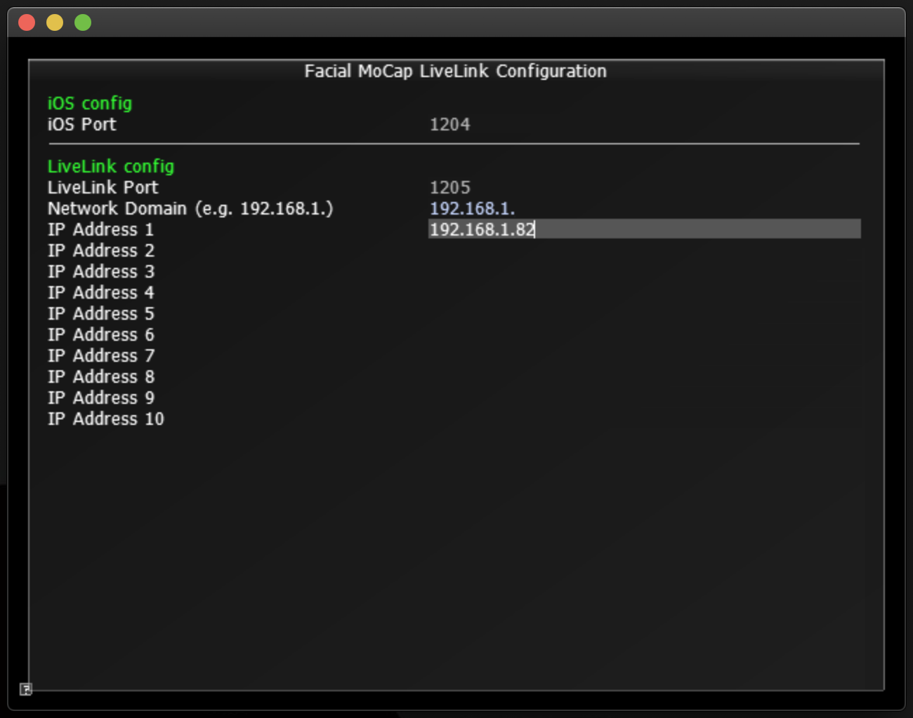
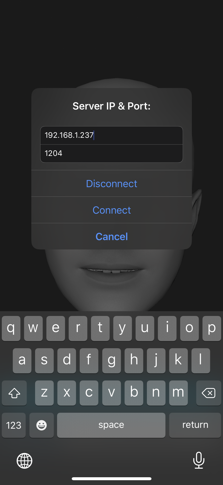

# Facial MoCap UDP Broadcaster

This app enables to convert incoming blendshape data from [Face Cap - Motion Capture](https://apps.apple.com/us/app/face-cap-motion-capture/id1373155478) iOS app to UDP packet and bypass it to a list of IP addresses to broadcast.

## Supported platforms
- Mac OS
- Windows

## Dependencies
- [Cinder v0.9.2](https://github.com/cinder/Cinder/tree/release_v0.9.2)
- [Cinder Asio Block](https://github.com/BanTheRewind/Cinder-Asio)
- [Cinder OSC Block](https://github.com/cinder/Cinder/tree/release_v0.9.2/blocks/OSC)

## iOS configuration
- Set the Server IP as your machine's and Server Port as `1204` for live streaming on Face Cap - Motion Capture iOS app

## Target app configuration
- Set the UDP port as `1205` to receive data
- Set the Network Domain as the three first numbers of your machine's IP address (i.e. `192.168.1.`); this is only to validate target IP address
- Add IP address to the list for broadcasting (Currently you can add up to 10)
