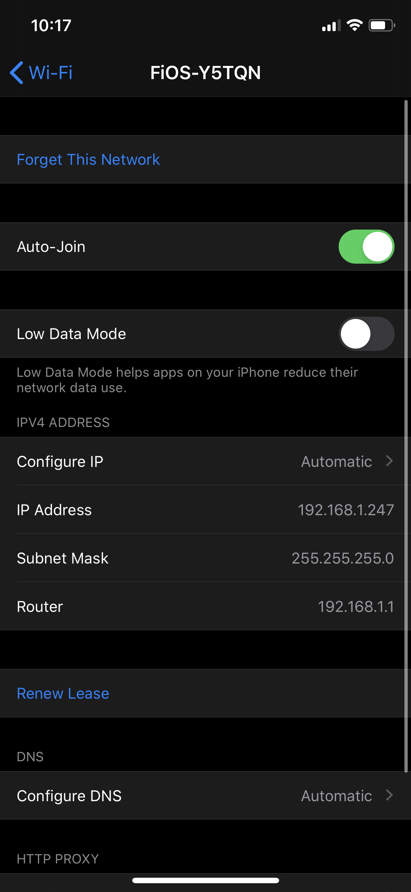
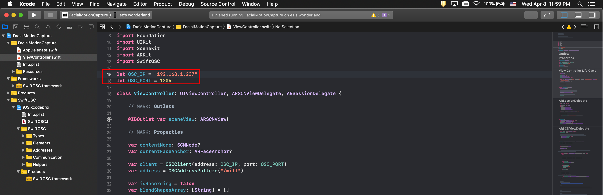

# Facial Motion Capture
`Facial MoCap` iOS app enables you to use facial blend shape coefficients provided by ARKit in your application via [OSC(Open Sound Control)](https://en.wikipedia.org/wiki/Open_Sound_Control)

<b>IMAGE; iPhone screenshot</b>

## Requirements
Check your iOS device compatibility with ARKit from [here](https://developer.apple.com/library/archive/documentation/DeviceInformation/Reference/iOSDeviceCompatibility/DeviceCompatibilityMatrix/DeviceCompatibilityMatrix.html)


## ARKit's Blendshape Location
For each key, the corresponding value is a floating point number indicating the current position of that feature relative to its neutral configuration, ranging from 0.0 (neutral) to 1.0 (maximum movement). See the full list of locations from [here](README_BlendshapeLocation.md)

&emsp;&emsp;&emsp;&emsp;&emsp;&emsp;


## Network Settings for OSC
1. Configure both your iOS device and target machine where your application is running with the same network

2. Find target machine's IP address

// image windows

For Mac, go to System Preferences > Network and find the IP address


3. Check network settings on iOS device. Go to Settings > Wi-Fi > Select your network and check the following:
- IP Address: 192.168.1.247 the first three number should be matched with your machine
- Subnet Mask: 255.255.255.0
- Router: 192.168.1.1 the first three number should be matched with your machine and the last number usually 1



4. Change `OSC_IP` value with the target machine's IP address at line 15 in [ViewController.swift](FacialMotionCapture/FacialMotionCapture/ViewController.swift)

```
let OSC_IP = "192.168.1.100"
let OSC_PORT = 1204
```


5. Create an OSC server with the same IP address and port number in your target application 


## iOS App Installation
1. Download Xcode from App Store
2. Open FacialMotionCapture.xcodeproj with Xcode
3. Connect your iOS device to Mac
4. Add `The Mill Group Inc` to Team in Signing & Capabilities tab; ask Jimmy to add you with your @themill.com email to the Apple developer account


5. Run(Command + R) the project or find the menu Run from Product


## Data Format
```
json data sample
```

## Examples
Check out [examples](/examples)


## Reference
- [ARKit's ARFaceAnchor BlendShapeLocation](https://developer.apple.com/documentation/arkit/arfaceanchor/blendshapelocation)
