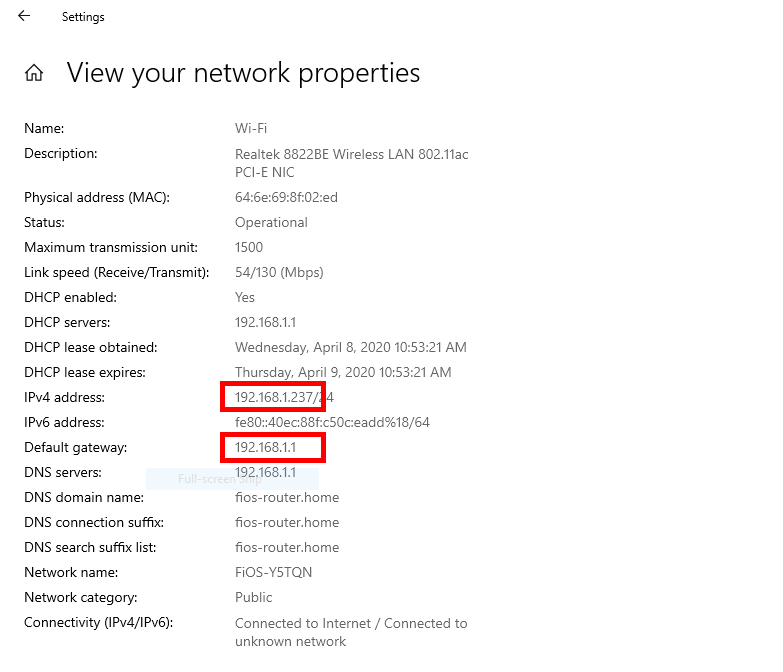
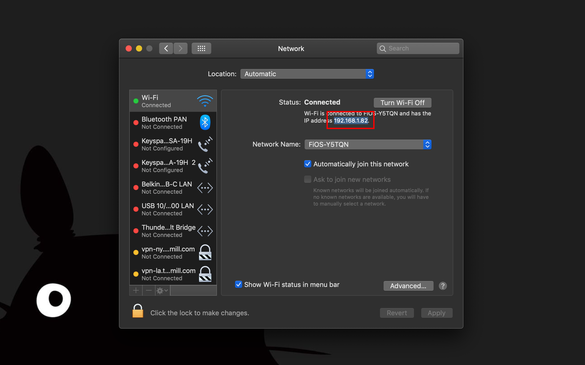
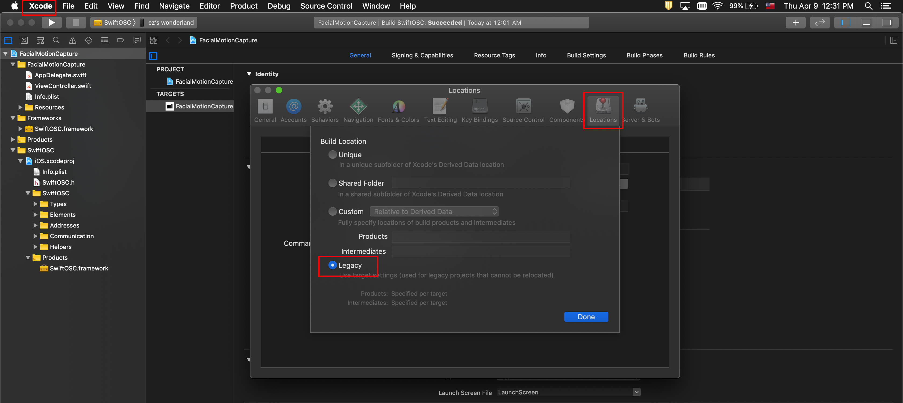
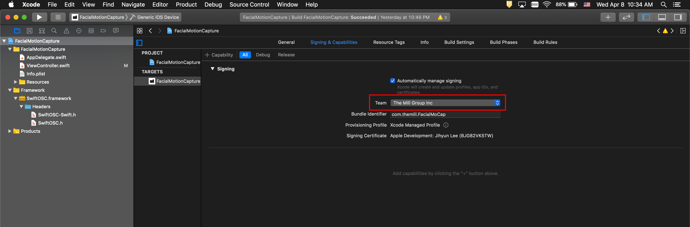
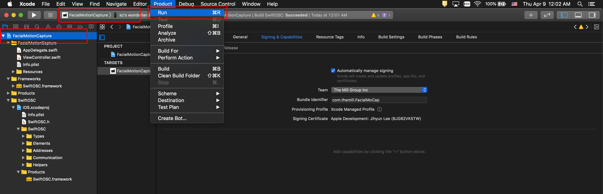
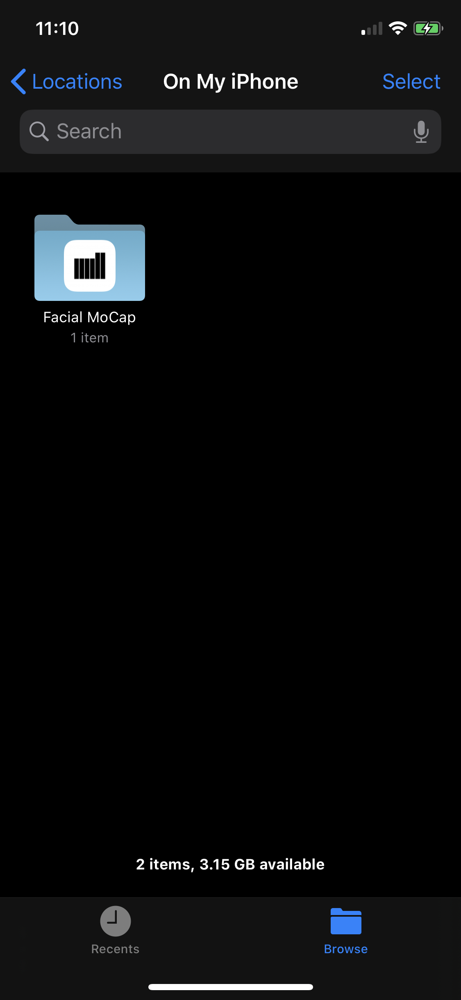

# Facial Motion Capture
`Facial MoCap` iOS app enables you to use facial blend shape coefficients provided by ARKit in your application.
You can get data stream in real-time via [UDP(User Datagram Protocol)](https://en.wikipedia.org/wiki/User_Datagram_Protocol) or record data to a json file.

&emsp;&emsp;&emsp;&emsp;&emsp;&emsp;

## Requirements
Check your iOS device compatibility with ARKit from [here](https://developer.apple.com/library/archive/documentation/DeviceInformation/Reference/iOSDeviceCompatibility/DeviceCompatibilityMatrix/DeviceCompatibilityMatrix.html)


## ARKit's Blendshape Location
For each key, the corresponding value is a floating point number indicating the current position of that feature relative to its neutral configuration, ranging from 0.0 (neutral) to 1.0 (maximum movement). See the full list of locations from [here](README_BlendshapeLocation.md)

&emsp;&emsp;&emsp;&emsp;&emsp;&emsp;


## Network Settings for Live Stream
You can skip this step if you want to use recording

1. Make sure both your iOS device and target machine(s) on the same network

2. Find all of target machines' IP addresses

For Windows, go to Settings > Network & Internet > View your network properties



For Mac, go to System Preferences > Network and find the IP address



3. Add the ip address to the array `UDP_IPADDRESSES` at line line 14 in [ViewController.swift](FacialMotionCapture/FacialMotionCapture/ViewController.swift)
```
let UDP_IPADDRESSES = ["10.63.111.129", "10.63.111.130"]
```

4. Set the port number as `1204` in your target application (Unreal, Unity, etc)


## iOS App Installation
1. Download Xcode from App Store
2. Open FacialMotionCapture.xcodeproj with Xcode
3. Set the Xcode Build Location as `Legacy` from Xcode Preferences > Locations > Advanced > Legacy



4. Connect your iOS device to Mac
5. Add `The Mill Group Inc` to Team in Signing & Capabilities tab; ask Jimmy to add you with your @themill.com email to the Apple developer account



6. Select `FacialMotionCapture.xcodeproj`, change target scheme to `FacialMotionCapture` and then Run(Command + R) the project




## Data Format
```
{
   "eyeSquint_R":0.1332,
   "mouthDimple_L":0.0834,
   "mouthFrown_L":0.0786,
   "mouthPress_R":0.0239,
   "mouthRollLower":0.0824,
   "browOuterUp_R":0.0249,
   "mouthDimple_R":0.0744,
   "cheekSquint_L":0.0346,
   "cheekSquint_R":0.0363,
   "mouthRight":0.0045,
   "eyeWide_L":-0.0011,
   "mouthPucker":0.0755,
   "mouthFrown_R":0.0654,
   "mouthLeft":0.0013,
   "mouthStretch_L":0.1495,
   "eyeLookIn_L":0.0,
   "mouthSmile_L":0.0005,
   "mouthUpperUp_L":0.0203,
   "mouthLowerDown_L":0.0615,
   "jawRight":0.016,
   "noseSneer_L":0.0627,
   "mouthSmile_R":0.0001,
   "eyeBlink_R":0.1402,
   "jawLeft":0.0,
   "jawForward":0.0287,
   "jawOpen":0.0465,
   "eyeLookDown_L":0.2212,
   "eyeLookOut_L":0.0872,
   "mouthShrugLower":0.0734,
   "mouthUpperUp_R":0.0208,
   "mouthShrugUpper":0.0447,
   "mouthPress_L":0.0271,
   "mouthStretch_R":0.171,
   "cheekPuff":0.04,
   "eyeLookIn_R":0.2009,
   "browOuterUp_L":0.0235,
   "mouthRollUpper":0.1026,
   "browInnerUp":0.1673,
   "eyeLookOut_R":0.0,
   "eyeWide_R":-0.0011,
   "eyeLookDown_R":0.2198,
   "eyeSquint_L":0.1335,
   "mouthFunnel":0.0788,
   "noseSneer_R":0.0612,
   "browDown_R":0.0202,
   "eyeBlink_L":0.1402,
   "eyeLookUp_R":0.0,
   "browDown_L":0.0207,
   "mouthClose":0.0504,
   "tongueOut":0.0,
   "mouthLowerDown_R":0.0649,
   "eyeLookUp_L":0.0
}
```

## Record Data to a .json File
1. To record, use the record/stop button on the bottom of the iOS device screen
2. Find `data_yyyy_mm_dd_hh_mm_ss.json` from Facial MoCap folder in Files app




## Examples
Check out [examples](/examples)


## Reference
- [ARKit's ARFaceAnchor BlendShapeLocation](https://developer.apple.com/documentation/arkit/arfaceanchor/blendshapelocation)


## Todo
Check out the [board](https://github.com/themill/FacialMoCap/projects/1)
