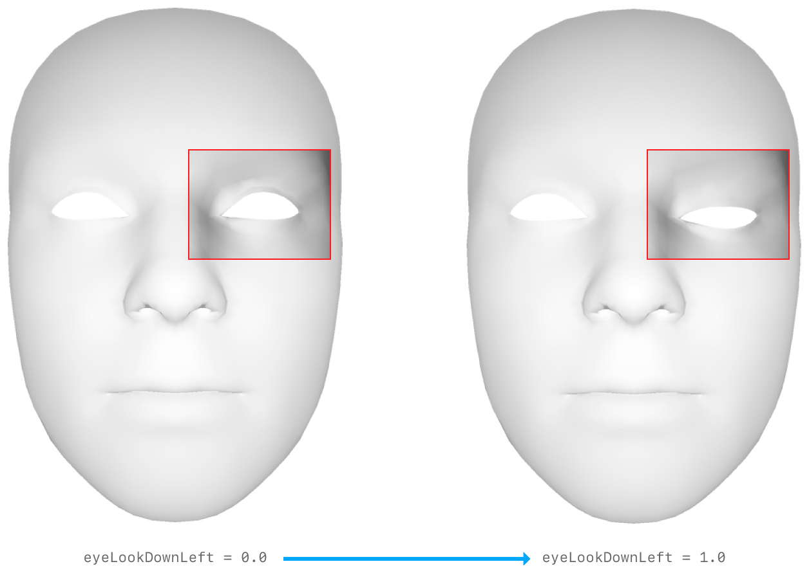
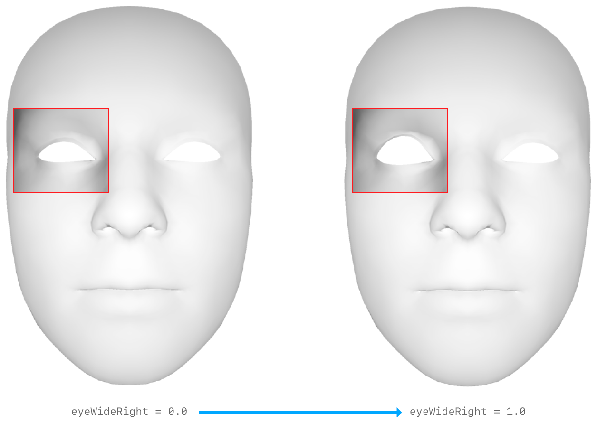

# Facial Motion Capture
`Facial MoCap` iOS app enables to animate a character in real-time using blend shape coefficients recognized by ARKit. 

<b>IMAGE; iPhone screenshot</b>

### ARKit's Blendshape Location
For each key, the corresponding value is a floating point number indicating the current position of that feature relative to its neutral configuration, ranging from 0.0 (neutral) to 1.0 (maximum movement)

#### Eyes
&emsp;&emsp;&emsp;&emsp;&emsp;&emsp;
&emsp;&emsp;&emsp;&emsp;&emsp;&emsp;
&emsp;&emsp;&emsp;&emsp;&emsp;&emsp;
&emsp;&emsp;&emsp;&emsp;&emsp;&emsp;
&emsp;&emsp;&emsp;&emsp;&emsp;&emsp;
&emsp;&emsp;&emsp;&emsp;&emsp;&emsp;
&emsp;&emsp;&emsp;&emsp;&emsp;&emsp;

##### Jaw

### iOS app installation
1. Download Xcode from App Store
2. Open FacialMotionCapture.xcodeproj with Xcode
3. 

### Set up OSC environment

### Examples
There are [examples](/examples) in Cinder and Unreal Engine. As long as your application supports [OSC(Open Sound Control)](https://en.wikipedia.org/wiki/Open_Sound_Control), it can receive blendshape data from the `Facial MoCap` app.

### Reference
- [ARKit's ARFaceAnchor BlendShapeLocation](https://developer.apple.com/documentation/arkit/arfaceanchor/blendshapelocation)
