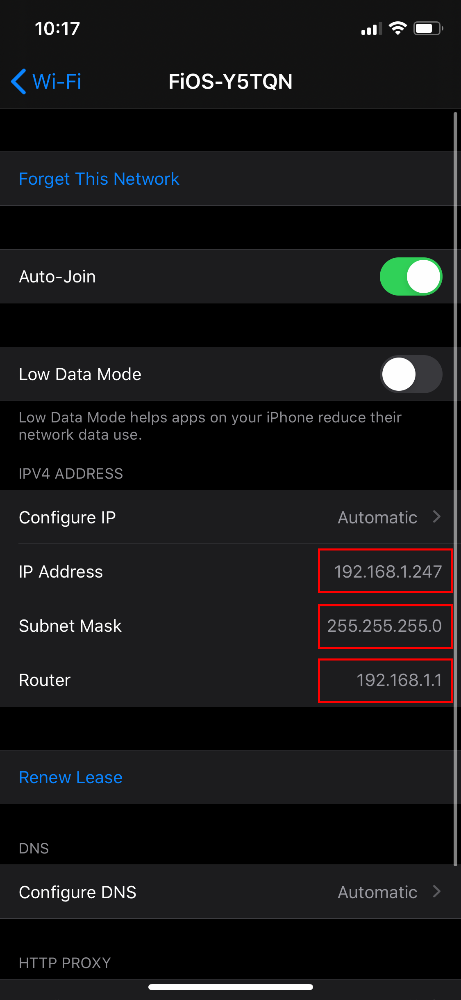
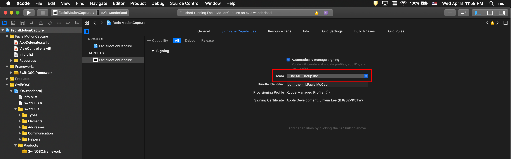

# Facial Motion Capture
`Facial MoCap` iOS app enables you to use facial blend shape coefficients provided by ARKit in your application via [OSC(Open Sound Control)](https://en.wikipedia.org/wiki/Open_Sound_Control)

&emsp;&emsp;&emsp;&emsp;&emsp;&emsp;

## Requirements
Check your iOS device compatibility with ARKit from [here](https://developer.apple.com/library/archive/documentation/DeviceInformation/Reference/iOSDeviceCompatibility/DeviceCompatibilityMatrix/DeviceCompatibilityMatrix.html)


## ARKit's Blendshape Location
For each key, the corresponding value is a floating point number indicating the current position of that feature relative to its neutral configuration, ranging from 0.0 (neutral) to 1.0 (maximum movement). See the full list of locations from [here](README_BlendshapeLocation.md)

&emsp;&emsp;&emsp;&emsp;&emsp;&emsp;


## Network Settings for OSC
1. Configure both your iOS device and target machine where your application is running with the same network

2. Find target machine's IP address

For Windows, go to Settings > Network & Internet > View your network properties


For Mac, go to System Preferences > Network and find the IP address


3. Check network settings on iOS device. Go to Settings > Wi-Fi > Select your network and check the following:
- IP Address: 192.168.1.247 the first three number should be matched with your machine
- Subnet Mask: 255.255.255.0
- Router: 192.168.1.1 the first three number should be matched with your machine and the last number usually 1



4. Change `OSC_IP` value with the target machine's IP address at line 15 in [ViewController.swift](FacialMotionCapture/FacialMotionCapture/ViewController.swift)

```
let OSC_IP = "192.168.1.100"
let OSC_PORT = 1204
```


5. Create an OSC server with the same IP address and port number in your target application 


## iOS App Installation
1. Download Xcode from App Store
2. Open FacialMotionCapture.xcodeproj with Xcode
3. Connect your iOS device to Mac
4. Add `The Mill Group Inc` to Team in Signing & Capabilities tab; ask Jimmy to add you with your @themill.com email to the Apple developer account



5. Run(Command + R) the project or find the menu Run from Product


## Data Format
```
{
   "mouthRollLower":0.024697193875908852,
   "eyeLookDown_R":0.18290522694587708,
   "cheekSquint_R":0.097056657075881958,
   "eyeSquint_R":0.19390477240085602,
   "eyeBlink_R":-0.015295968391001225,
   "browDown_L":0.011871623806655407,
   "mouthFunnel":0.086770206689834595,
   "tongueOut":3.2853513403097168e-06,
   "eyeLookUp_L":0,
   "mouthSmile_R":0.59344512224197388,
   "mouthStretch_R":0.41761273145675659,
   "mouthUpperUp_R":0.16863000392913818,
   "eyeLookOut_R":0.43159151077270508,
   "browOuterUp_R":0.20074711740016937,
   "browInnerUp":0.30309808254241943,
   "eyeLookIn_R":0,
   "mouthPucker":0.017998037859797478,
   "eyeSquint_L":0.20365799963474274,
   "mouthShrugLower":0.012198335491120815,
   "cheekPuff":0.0044027506373822689,
   "eyeLookUp_R":0,
   "eyeLookDown_L":0.17973992228507996,
   "eyeLookOut_L":0,
   "mouthDimple_L":0.1404988169670105,
   "mouthFrown_L":0.00013260745618026704,
   "mouthUpperUp_L":0.16354158520698547,
   "mouthSmile_L":0.51254928112030029,
   "mouthShrugUpper":0.27297312021255493,
   "jawForward":0.10034298896789551,
   "browOuterUp_L":0.19962942600250244,
   "mouthStretch_L":0.38459193706512451,
   "noseSneer_L":0.14289872348308563,
   "browDown_R":0.011707711033523083,
   "mouthDimple_R":0.10559886693954468,
   "cheekSquint_L":0.085585415363311768,
   "mouthFrown_R":-0.00010155476775253192,
   "jawRight":0.038813751190900803,
   "mouthRollUpper":0.029253650456666946,
   "eyeWide_R":0.066033408045768738,
   "mouthLeft":0.0041139982640743256,
   "jawOpen":0.56022810935974121,
   "jawLeft":0.0013824561610817909,
   "mouthPress_R":0.025483584031462669,
   "eyeLookIn_L":0.53524976968765259,
   "eyeWide_L":0.069199591875076294,
   "noseSneer_R":0.13912542164325714,
   "mouthLowerDown_R":0.66249096393585205,
   "eyeBlink_L":-0.015938781201839447,
   "mouthRight":0.06049463152885437,
   "mouthClose":0.035748790949583054,
   "mouthLowerDown_L":0.63351577520370483,
   "mouthPress_L":0.034522276371717453
}
```

## Examples
Check out [examples](/examples)


## Reference
- [ARKit's ARFaceAnchor BlendShapeLocation](https://developer.apple.com/documentation/arkit/arfaceanchor/blendshapelocation)
