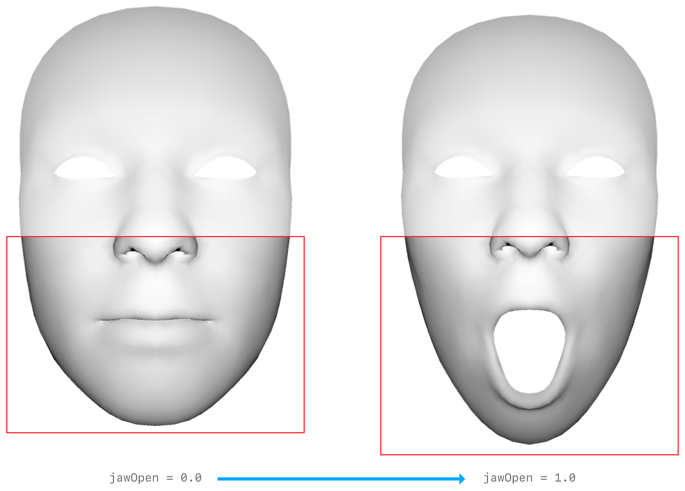

# Facial Motion Capture
`Facial MoCap` iOS app enables to animate a character in real-time using blend shape coefficients recognized by ARKit. 

<b>IMAGE; iPhone screenshot</b>

## ARKit's Blendshape Location
For each key, the corresponding value is a floating point number indicating the current position of that feature relative to its neutral configuration, ranging from 0.0 (neutral) to 1.0 (maximum movement). See the full list of locations from [here](README_BlendshapeLocation.md)

&emsp;&emsp;&emsp;&emsp;&emsp;&emsp;

## iOS App Installation
1. Download Xcode from App Store
2. Open FacialMotionCapture.xcodeproj with Xcode
3. Connect your iOS device to Mac
4. Add `The Mill Group Inc` to Team in Signing & Capabilities tab; ask Jimmy to add you with your @themill.com email to the Apple developer account

// Image

5. Run(Command + R) the project or find the menu Run from Product

// Image


## Network Settings for OSC


## Examples
There are [examples](/examples) in Cinder and Unreal Engine. As long as your application supports [OSC(Open Sound Control)](https://en.wikipedia.org/wiki/Open_Sound_Control), it can receive blendshape data from the `Facial MoCap` app.

```
json data sample
```

## Reference
- [ARKit's ARFaceAnchor BlendShapeLocation](https://developer.apple.com/documentation/arkit/arfaceanchor/blendshapelocation)
