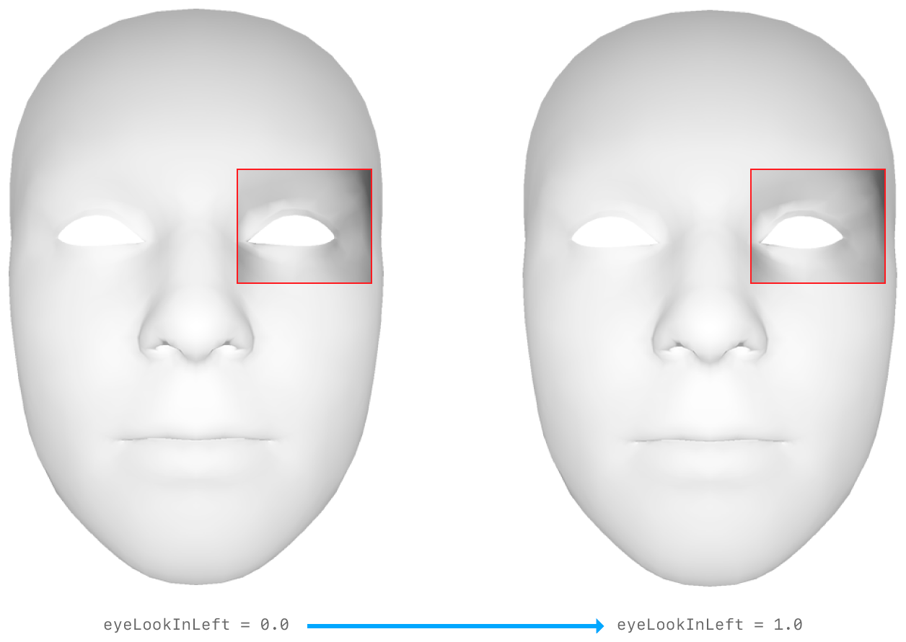

## ARKit's Blendshape Location
For each key, the corresponding value is a floating point number indicating the current position of that feature relative to its neutral configuration, ranging from 0.0 (neutral) to 1.0 (maximum movement)

### Eyes
&emsp;&emsp;&emsp;&emsp;&emsp;&emsp;

&emsp;&emsp;&emsp;&emsp;&emsp;&emsp;

&emsp;&emsp;&emsp;&emsp;&emsp;&emsp;

&emsp;&emsp;&emsp;&emsp;&emsp;&emsp;

&emsp;&emsp;&emsp;&emsp;&emsp;&emsp;

&emsp;&emsp;&emsp;&emsp;&emsp;&emsp;

&emsp;&emsp;&emsp;&emsp;&emsp;&emsp;

### Jaw
&emsp;&emsp;&emsp;&emsp;&emsp;&emsp;

&emsp;&emsp;&emsp;&emsp;&emsp;&emsp;

