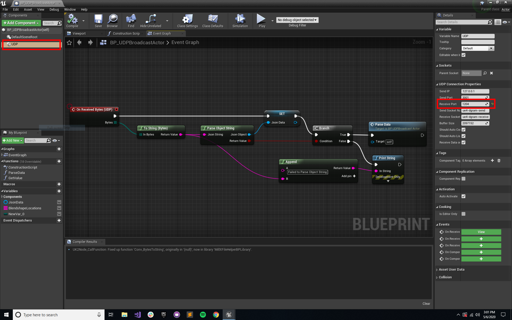

# Facial Motion Capture Example in Unreal Engine

## Requirement
UE v4.24 or later

## Dependencies
- [JsonBlueprint](./Plugins/JsonBlueprint) plugin
- [MillXUtils](./Plugins/MillXUtils) plugin
- [upd-ue4](./Plugins/udp-ue4) plugin

## Usage in Blueprint

### Add UDP component to your actor and set the port as 1204

### Add UDP's On Received Bytes event listener node

### Parse Data

