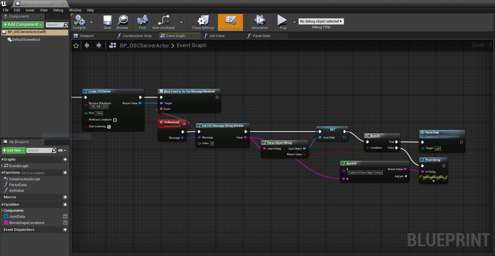
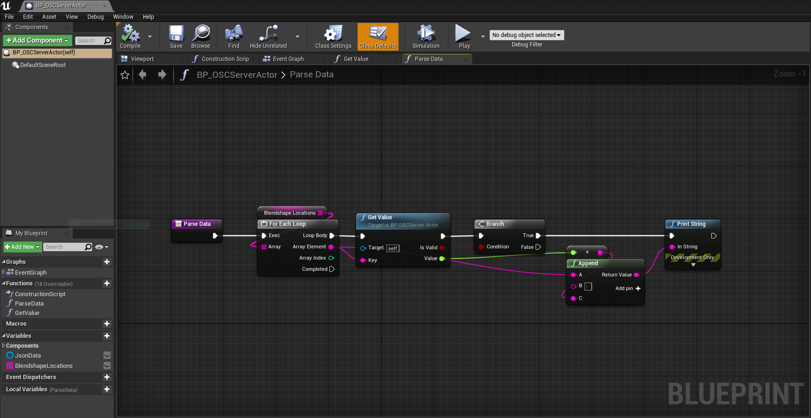

# Facial Motion Capture Example in Unreal Engine

## Requirement
UE v4.24 or later

## Dependencies
- [JsonBlueprint](./Plugins/JsonBlueprint) plugin

## Usage in Blueprint

### Create an OSC Server 
IP address and port number in CreateOSCServer node should be matched with iOS

### Parse data

